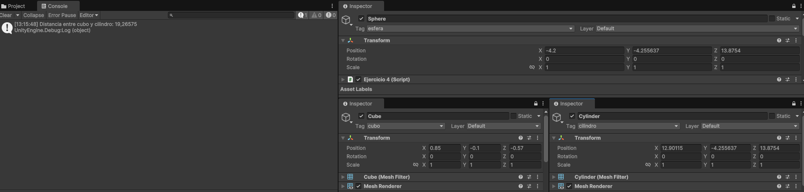

# Práctica de Scripts – Movimiento en Unity

Este proyecto contiene una serie de ejercicios prácticos de scripting en Unity enfocados en transformaciones, entrada de usuario y manipulación de objetos. Cada ejercicio incluye uno o varios archivos demostrativos en formato **GIF** o **PNG**, según el caso.

---

## Ejercicio 1 – Cambio aleatorio de color  
El objeto cambia aleatoriamente el valor de una de sus componentes RGB cada cierto número de frames, configurables desde el inspector.  

---

## Ejercicio 2 – Operaciones con vectores  
Se calculan propiedades básicas de dos vectores (`v0` y `v1`): magnitud, ángulo, distancia y comparación en el eje Y.  

---

## Ejercicio 3 – Mostrar posición de la esfera  
Se obtiene y muestra en consola la posición (`transform.position`) de una esfera al iniciar la escena.  

---

## Ejercicio 4 – Distancia entre objetos  
Se calcula la distancia entre una esfera y un cilindro localizados por su etiqueta con `GameObject.FindWithTag`.  

---

## Ejercicio 5 – Desplazamiento con barra espaciadora  
Cada objeto se desplaza un vector configurable desde el inspector al presionar la barra espaciadora.  

---

## Ejercicio 6 – Velocidad proporcional a teclas de flecha  
El script detecta las flechas y multiplica la velocidad (`speed`) por el valor del eje correspondiente, mostrando la información en consola.  

---

## Ejercicio 7 – Mapeo de la tecla de disparo  
La tecla `H` está asignada a la acción de disparo mediante el Input Manager. El script detecta su pulsación y ejecuta la función correspondiente.  

---

## Ejercicio 8 – Movimiento del cubo con dirección y velocidad  
El cubo se mueve en la dirección definida por un vector normalizado, multiplicado por la velocidad. Incluye variaciones en diferentes escenas.  

  
  

---

## Ejercicio 9 – Movimiento del cubo y la esfera con teclas  
El cubo se mueve con los ejes `Horizontal` y `Vertical`, y la esfera con `Horizontal2` y `Vertical2` mapeados a `WASD`.  

---

## Ejercicio 10 – Movimiento proporcional al tiempo  
El movimiento se multiplica por `Time.deltaTime`, asegurando un desplazamiento uniforme independientemente del framerate.  

---

## Ejercicio 11 – Movimiento del cubo hacia la esfera  
El cubo se desplaza hacia la posición de la esfera calculando la dirección entre ambos objetos.  

---

## Ejercicio 12 – Movimiento del cubo mirando a la esfera  
El cubo orienta su `transform.forward` hacia la esfera y se mueve en esa dirección con velocidad constante.  

---

## Ejercicio 13 – Movimiento hacia adelante con rotación  
El objeto rota sobre su eje `transform.up` con el eje `Horizontal` y se desplaza en la dirección de su `transform.forward`.  

